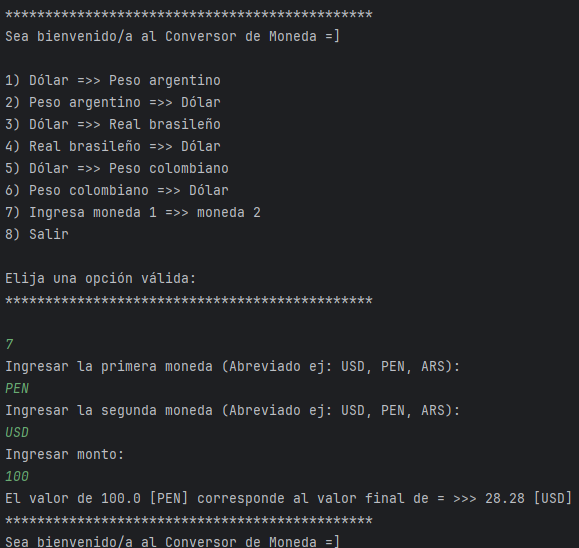

# Conversor de Monedas 🌍💱



## Badges


## Índice
- [Descripción](#descripción)
- [Estado del proyecto](#estado-del-proyecto)
- [Características](#características)
- [Instalación](#instalación)
- [Uso](#uso)
- [Tecnologías](#tecnologías)
- [Contribuidores](#contribuidores)
- [Licencia](#licencia)

---

## Descripción
Aplicación de consola en Java que permite convertir montos entre diversas monedas (USD, ARS, BRL, COP, PEN u otras códigos ISO). Utiliza la API de ExchangeRate‑API para obtener tasas de cambio actualizadas.

## Estado del proyecto
**Estado: Estable (v1.0)**  
Funcionalidades principales implementadas: conversión básica, entrada manual de monedas, manejo de errores de entrada. Futuras mejoras en la hoja de ruta.

## Características
- Conversión entre monedas comunes — USD, ARS, BRL, COP.
- Opción de ingresar cualquier moneda válida mediante código ISO.
- Manejo de errores para entradas inválidas o fallos de conexión.
- Respuesta JSON formateada usando **Gson**.

## Instalación
1. Clona el repositorio:
   ```bash
   git clone https://github.com/Leo-mael/conversor-monedas-java
   cd repositorio-conversor
